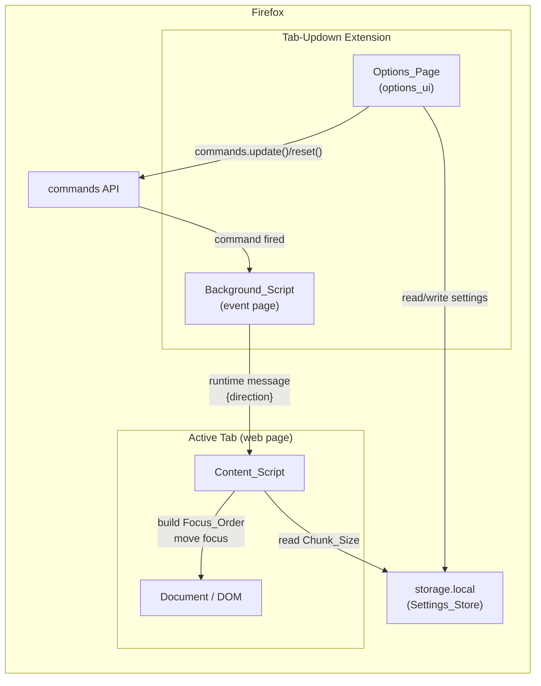
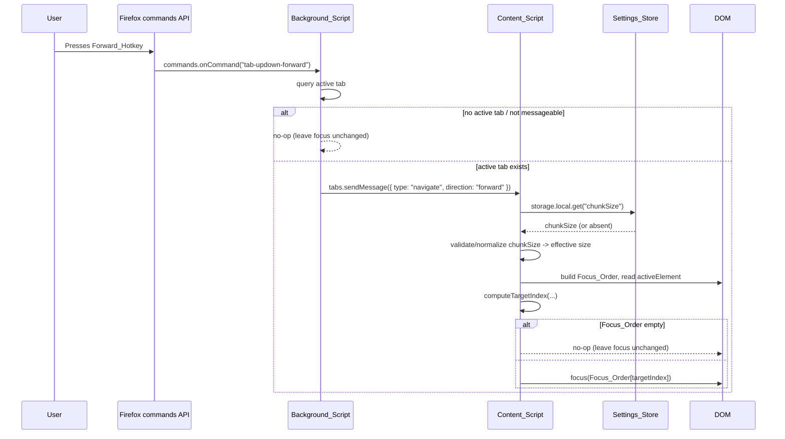

# Design Document: Tab-Updown

## Overview

Tab-Updown is a Firefox WebExtension that moves keyboard focus through a page's
focusable elements in configurable chunks — the "Page Up / Page Down" analogue for
the Tab key. A user presses the **Forward_Hotkey** to jump focus forward by
**Chunk_Size** elements along the page's **Focus_Order**, and the **Backward_Hotkey**
to jump backward by the same amount. Both the chunk size and the two hotkeys are
user-configurable, have defaults, and persist across browser sessions.

The extension is composed of four cooperating parts, following the
[Mozilla WebExtensions guidelines](https://developer.mozilla.org/en-US/docs/Mozilla/Add-ons/WebExtensions):

- A **manifest.json** that declares metadata, the background script, the content
  script, the two `commands`, the `options_ui` page, and the minimal permission set.
- A **Background_Script** that listens to the `commands` API and relays a navigation
  message to the content script in the active tab.
- A **Content_Script** that builds the Focus_Order for the current document, computes
  the target index for a forward/backward chunk move, and moves focus.
- An **Options_Page** (`options_ui`) that loads, validates, and saves the Chunk_Size
  and the two hotkeys via the `storage` and `commands` APIs.

### Technology Stack

The extension is implemented in **TypeScript**, compiled to plain **JavaScript** that
ships in the packaged extension. The Options_Page markup and styling are authored in
**HTML/CSS**. TypeScript is chosen because:

- The WebExtension surface is typed via `@types/firefox-webext-browser`, so the
  `browser.*` namespace, the `commands`, `storage`, `tabs`, and `runtime` APIs, and
  their promise-based signatures are checked at compile time rather than discovered at
  runtime.
- The pure focus-math functions (`computeTargetIndex`, `buildFocusOrder`,
  `normalizeChunkSize`, `validateChunkSize`, the conflict predicate) benefit from
  static types, which make refactoring these clamping/ordering routines safe and keep
  the index/`-1`-sentinel conventions honest.
- Typed generators and assertions are a natural fit with the `fast-check`
  property-based tests described in the Testing Strategy, since the arbitraries and the
  functions under test share the same type definitions.

#### Tooling

- **TypeScript compiler + bundler.** `tsc` provides type checking; a bundler
  (recommend **esbuild** or **Vite**) bundles each entry point — `background.ts`,
  `content.ts`, `options.ts` — into plain JavaScript that the manifest references
  (`background.js`, `content.js`, `options.js`). Bundling emits those exact filenames,
  so the manifest script names below need no change.
- **Typed WebExtension APIs.** `@types/firefox-webext-browser` supplies types for the
  promise-based `browser.*` namespace used throughout the design.
- **Test runner.** **Jest** (via `ts-jest`) runs the suite, with **fast-check** for the
  property-based tests and **jsdom** for DOM integration tests. Test results are emitted
  as a CTRF JSON report via **jest-ctrf-json-reporter**.
- **web-ext.** Mozilla's [`web-ext`](https://extensionworkshop.com/documentation/develop/getting-started-with-web-ext/)
  CLI runs/loads the extension during development and packages the built output for
  distribution.

#### Proposed Source Layout

```
tab-updown-ff/
├── manifest.json            # extension root; references built dist/*.js outputs
├── src/
│   ├── background.ts        # commands.onCommand listener; relays NavigateMessage
│   ├── content.ts           # onMessage handler; builds order, moves focus
│   ├── options.ts           # options page logic (load/validate/save)
│   ├── options.html         # options_ui page markup
│   ├── options.css          # options_ui page styling
│   └── lib/
│       ├── focus.ts         # buildFocusOrder, indexOfCurrentFocus, computeTargetIndex
│       ├── settings.ts      # validateChunkSize, normalizeChunkSize
│       ├── constants.ts     # DEFAULT_CHUNK_SIZE, command names, default hotkeys, etc.
│       └── hotkeys.ts       # hotkey conflict predicate
├── tests/                   # property tests + integration tests
└── dist/                    # build output (background.js, content.js, options.js, …)
                             # this is what web-ext packages
```

The modules under `src/lib/` — `focus.ts`, `settings.ts`, and `hotkeys.ts` — are
**DOM-free** pure logic (with the exception of `buildFocusOrder`, which reads a
`Document`/element descriptors and is tested against jsdom fixtures). Their pure
functions are directly unit- and property-testable in isolation, exactly as the
Correctness Properties and Testing Strategy sections describe. The entry-point files
(`background.ts`, `content.ts`, `options.ts`) hold the thin WebExtension wiring and
import from `src/lib/`.

### Design Goals

- Keep focus computation entirely in the content script, where it has direct access
  to the live DOM and the document's `activeElement`.
- Keep the background script thin: it only translates command events into messages,
  which lets it run as a non-persistent event page.
- Treat the index-computation/clamping logic as a pure function so it can be
  exhaustively property-tested independently of the DOM.
- Request the smallest permission set that satisfies the requirements (Requirement
  7.2).

### Research Notes Informing the Design

- **Manifest version.** Firefox supports Manifest V3, and for MV3 it supports
  *non-persistent* background scripts declared with a `scripts` array (an event page)
  rather than a Chrome-style service worker. Event listeners must be registered at the
  top level of the script so Firefox can wake the page when a command fires. This
  design targets **Manifest V3** for forward compatibility with Firefox's add-on
  platform direction, using a non-persistent event page. Sources:
  [MDN Background scripts](https://developer.mozilla.org/en-US/docs/Mozilla/Add-ons/WebExtensions/Background_scripts),
  [Mozilla MV3 migration guidance](https://blog.mozilla.org/addons/2022/10/31/begin-your-mv3-migration-by-implementing-new-features-today/).
  Content was rephrased for compliance with licensing restrictions.
- **Runtime hotkey reconfiguration.** Firefox exposes
  [`browser.commands.update({ name, shortcut })`](https://developer.mozilla.org/en-US/docs/Mozilla/Add-ons/WebExtensions/API/commands/update)
  to change a command's shortcut at runtime, and `browser.commands.reset(name)` to
  restore the manifest default. Firefox validates the shortcut string and rejects
  invalid combinations by rejecting the returned promise, which the Options_Page uses
  for invalid-key handling (Requirement 4.7).
- **API namespace.** Firefox provides the promise-based `browser.*` namespace on all
  asynchronous APIs, which this design uses throughout.

## Architecture

### Component Topology



### Control Flow: A Chunk Move



### Why This Split

- The `commands` API delivers command events only to the background context, so the
  Background_Script must own the `commands.onCommand` listener (Requirement 5.1, 5.2).
- Focus movement requires the live DOM and `document.activeElement`, which only a
  content script can access for the page (Requirement 1, 2).
- Reading Chunk_Size happens in the content script on each navigation so the freshest
  stored value is always used (Requirement 5.3), avoiding cache-staleness bugs.
- The Options_Page owns hotkey reconfiguration because `commands.update()` /
  `commands.reset()` are callable from any extension page and the options page is the
  natural place for user configuration (Requirement 4).

## Components and Interfaces

### manifest.json

Declares the extension per Requirement 7.1 / 7.5 and the minimal permissions per
Requirement 7.2.

```json
{
  "manifest_version": 3,
  "name": "Tab-Updown",
  "version": "1.0.0",
  "description": "Move focus through focusable elements in configurable chunks.",
  "permissions": ["storage"],
  "background": {
    "scripts": ["background.js"]
  },
  "content_scripts": [
    {
      "matches": ["<all_urls>"],
      "all_frames": false,
      "js": ["content.js"]
    }
  ],
  "options_ui": {
    "page": "options.html",
    "open_in_tab": false
  },
  "commands": {
    "tab-updown-forward": {
      "suggested_key": { "default": "Alt+Shift+Down" },
      "description": "Move focus forward by one chunk"
    },
    "tab-updown-backward": {
      "suggested_key": { "default": "Alt+Shift+Up" },
      "description": "Move focus backward by one chunk"
    }
  }
}
```

Notes:
- The referenced script filenames (`background.js`, `content.js`, `options.js`) are the
  bundler's build outputs (in `dist/`) compiled from `src/background.ts`,
  `src/content.ts`, and `src/options.ts`. Because the bundler emits those exact names,
  the manifest references are unchanged by the move to TypeScript.
- The background is a non-persistent event page (no `persistent` key in MV3, no
  service worker file needed for Firefox).
- Permissions are limited to `storage`. Moving focus is done by the content script
  injected via `content_scripts` on page load, so no `activeTab`/`tabs` host
  permission is required to *inject*; the background reaches the already-injected
  content script via `tabs.sendMessage` using the tab id from
  `tabs.query({ active: true, currentWindow: true })`, which is available without a
  host permission. This satisfies Requirement 7.2's minimality constraint.
- The `commands` defaults encode Default_Forward_Hotkey and Default_Backward_Hotkey
  (Requirement 4.1, 4.5, 4.6).

### Background_Script (`background.js`)

Responsibilities:
- Register `browser.commands.onCommand` at the top level (so the event page can wake).
- On a command, resolve the active tab and forward a navigation message.

Interface:

```
onCommand(commandName):
    direction = commandName == "tab-updown-forward" ? "forward"
              : commandName == "tab-updown-backward" ? "backward"
              : null
    if direction is null: return
    tab = queryActiveTab()                       // tabs.query active+currentWindow
    if tab is absent or tab.id is missing: return   // Req 5.4: no-op
    try:
        sendMessage(tab.id, { type: "navigate", direction })   // Req 5.1 / 5.2
    catch (no receiver / restricted page):
        return                                    // Req 5.4: leave focus unchanged
```

The active-tab query and message send are initiated synchronously on receiving the
command; the 100 ms budget in Requirements 5.1/5.2 is met because both are local IPC
calls with no network or storage dependency in the background path.

### Content_Script (`content.js`)

Responsibilities:
- Listen for navigation messages from the background.
- On each message: read and normalize Chunk_Size, build the Focus_Order, locate the
  current focus index, compute the target index, and move focus.

Interface:

```
onMessage({ type, direction }):
    if type != "navigate": return
    chunkSize = normalizeChunkSize( await readStoredChunkSize() )   // Req 5.3, 3.6
    order = buildFocusOrder(document)                              // Req 1.2
    if order is empty: return                                       // Req 1.5, 2.4
    currentIndex = indexOfCurrentFocus(order, document.activeElement)
    target = computeTargetIndex(direction, currentIndex, chunkSize, order.length)
    order[target].focus()
```

The two pure helpers — `buildFocusOrder` (DOM-dependent) and `computeTargetIndex`
(pure arithmetic) — are separated so the arithmetic can be property-tested without a
DOM.

### Options_Page (`options.html` + `options.js`)

Responsibilities (Requirements 3, 4, 6, 7.4):
- On open, load the persisted Chunk_Size and the two active hotkeys and display them;
  where a value is absent, display the corresponding default (Requirement 6.2, 6.3).
- Validate and save Chunk_Size (Requirement 3.1, 3.2, 3.5).
- Validate and apply hotkey changes via `commands.update()` (Requirement 4.2, 4.3,
  4.4, 4.7, 4.8).
- Surface save confirmations, validation messages, conflict messages, and storage
  error messages (Requirement 3.2, 3.5, 4.7, 4.8, 7.4).

Interface (conceptual):

```
loadSettings():
    stored = storage.local.get(["chunkSize"])
    display chunkSize = stored.chunkSize ?? DEFAULT_CHUNK_SIZE
    commands = commands.getAll()
    display forwardShortcut  = commands["tab-updown-forward"].shortcut  ?? DEFAULT_FORWARD
    display backwardShortcut = commands["tab-updown-backward"].shortcut ?? DEFAULT_BACKWARD

saveChunkSize(raw):
    result = validateChunkSize(raw)               // Req 3.1, 3.5
    if not result.ok:
        show validation message (identify invalid value); keep stored value; return
    try:
        storage.local.set({ chunkSize: result.value })   // Req 3.2, 6.1, 7.3
        show save confirmation
    catch:
        show storage-error message; keep previous value   // Req 7.4

saveHotkeys(forwardStr, backwardStr):
    if normalize(forwardStr) == normalize(backwardStr):
        show conflict message; reject                     // Req 4.8
        return
    try:
        commands.update({ name: "tab-updown-forward",  shortcut: forwardStr })   // Req 4.3
        commands.update({ name: "tab-updown-backward", shortcut: backwardStr })  // Req 4.4
        show save confirmation
    catch (invalid shortcut rejected by Firefox):
        revert displayed value to previously active shortcut                    // Req 4.7
        show validation message
```

Design decision: the Chunk_Size is persisted in the Settings_Store, but the hotkeys
are persisted by Firefox itself as part of the command definition (updated via
`commands.update()` and readable via `commands.getAll()`). This avoids duplicating
hotkey state and keeps the manifest defaults as the single source of truth for
unconfigured hotkeys (Requirement 4.5, 4.6). To display hotkeys on the options page we
read `commands.getAll()` rather than the Settings_Store.

#### Hotkey_Recorder

The two hotkey fields (`#forward-hotkey`, `#backward-hotkey`) start as plain text
inputs that require the user to hand-type a Shortcut_String. The Hotkey_Recorder makes
those fields capture a pressed key combination instead: while a field holds focus, a
`keydown` listener reads the physical combination, formats it into Firefox's `commands`
shortcut grammar, and writes the resulting Shortcut_String into the field (Requirement
8.1, 8.2). The existing `saveHotkeys` logic — conflict check plus `commands.update()`
— is unchanged; the recorder only produces the string the field already carried.

The formatting and validation are two **DOM-free pure** helpers added to
`src/lib/hotkeys.ts` (alongside the existing conflict predicate), so they are
property-testable without a DOM. The DOM listener does nothing but translate a
`KeyboardEvent` into the plain descriptor the helpers consume:

```
KeyDescriptor {
    ctrl:  boolean      // event.ctrlKey
    alt:   boolean      // event.altKey
    shift: boolean      // event.shiftKey
    meta:  boolean      // event.metaKey (Command on Mac)
    key:   string       // event.key (the non-modifier key)
    isMac: boolean      // platform flag (navigator.platform / userAgentData)
}

keyEventToShortcut(descriptor): string | null
    // returns a grammar-valid Shortcut_String for a Valid_Combination,
    // or null for a modifier-only or unmapped-key press (Requirement 8.1, 8.2, 8.3)

isValidShortcut(str): boolean
    // true iff str matches Firefox's commands shortcut grammar (Requirement 8.8)
```

**Keydown capture.** The listener ignores `keydown` events whose `event.key` is itself
a modifier (`Shift`, `Control`, `Alt`, `Meta`) so that holding modifiers before the
final key does not produce output; it acts only when a non-modifier key arrives
(Requirement 8.3). On such a key it builds the descriptor from
`event.ctrlKey/altKey/shiftKey/metaKey` and `event.key`, calls `keyEventToShortcut`,
and `preventDefault()`s so the keypress does not otherwise act on the field. A non-null
result is written to the field (Requirement 8.1); a `null` result triggers a validation
message and the field keeps its previous value (Requirement 8.3).

**KeyboardEvent → token mapping.** `keyEventToShortcut` maps the descriptor to grammar
tokens as follows:

| KeyboardEvent input | Emitted token |
|---------------------|---------------|
| `ArrowUp` / `ArrowDown` / `ArrowLeft` / `ArrowRight` | `Up` / `Down` / `Left` / `Right` |
| `" "` (space) | `Space` |
| `","` | `Comma` |
| `"."` | `Period` |
| a letter `a`–`z` | uppercased `A`–`Z` |
| a digit `0`–`9` | the digit |
| `F1`–`F12` | `F1`–`F12` |
| `Home`, `End`, `PageUp`, `PageDown`, `Insert`, `Delete` | the same token |
| any other key | (unmapped → `null`) |
| `ctrlKey` on non-Mac | `Ctrl` (main modifier) |
| `ctrlKey` on Mac | `MacCtrl` (the real Control key) |
| `metaKey` on Mac | `Command` (main modifier) |
| `altKey` | `Alt` |
| `shiftKey` | `Shift` (secondary modifier) |

On Mac, per Firefox's grammar, `Ctrl` denotes Command; so the physical Command key
(`metaKey`) emits `Command` and the physical Control key (`ctrlKey`) emits `MacCtrl`
(Requirement 8.4). Modifier tokens are ordered main modifier, then secondary modifier,
then key, and the secondary modifier must differ from the main modifier.

**Validation predicate.** A descriptor forms a Valid_Combination — and
`keyEventToShortcut` returns a string rather than `null` — when the key maps to a token
**and** either (a) at least one main modifier is held, or (b) the key is a function key
`F1`–`F12` (which may stand alone). A press of modifiers only, or of an unmapped key,
or of a non-function key with no main modifier, yields `null` (Requirement 8.3).
`isValidShortcut(str)` independently recognizes exactly the strings matching the
grammar (2–3 tokens: main modifier + optional differing secondary modifier + key, or a
lone function key), and backs the typed-entry path (Requirement 8.8).

**Reset to default.** Each hotkey field is paired with a reset control
(`#forward-hotkey-reset`, `#backward-hotkey-reset`). Activating it calls
`browser.commands.reset(name)` to restore the manifest default and then re-reads
`commands.getAll()` to display the restored Shortcut_String — for the Forward_Hotkey
the Default_Forward_Hotkey and for the Backward_Hotkey the Default_Backward_Hotkey
(Requirement 8.5, 8.6).

**Accessible manual-typing fallback.** The fields remain ordinary text inputs, so a
user who cannot chord keys can type a Shortcut_String directly (Requirement 8.7). A
typed value is accepted on save only when `isValidShortcut` recognizes it, and is
otherwise rejected with a validation message while the previously active shortcut is
retained (Requirement 8.8); this reuses the same rejected-`commands.update()` revert
path as Requirement 4.7.

```
onHotkeyKeydown(field, event):
    if event.key is a modifier name: return          // Req 8.3: wait for a real key
    descriptor = { ctrl, alt, shift, meta, key: event.key, isMac }
    shortcut = keyEventToShortcut(descriptor)         // Req 8.1, 8.2
    event.preventDefault()
    if shortcut is null:
        show validation message; keep field's previous value   // Req 8.3
    else:
        field.value = shortcut                        // Req 8.1

onResetClick(field, commandName, defaultShortcut):
    commands.reset(commandName)                       // Req 8.6
    field.value = (commands.getAll() shortcut) ?? defaultShortcut   // Req 8.5, 8.6
```

### Messaging Protocol (Background ↔ Content)

A single message type flows from background to content script:

```
NavigateMessage {
    type: "navigate"
    direction: "forward" | "backward"
}
```

- Sent via `browser.tabs.sendMessage(tabId, message)` (Requirement 5.1, 5.2).
- The content script filters on `type === "navigate"` and ignores anything else.
- No response payload is required; the send is fire-and-forget. A rejected send
  (no content script in the target tab, e.g. a privileged page) is caught by the
  background and treated as a no-op (Requirement 5.4).

## Data Models

### Settings_Store Schema (`storage.local`)

The Settings_Store uses `storage.local` (not `storage.sync`). Rationale: the feature
is a personal navigation preference tied to how a user interacts with a specific
machine's keyboard workflow, and `storage.local` avoids sync quota and cross-device
merge concerns. Requirement 7.3's "within 1 second" and 6.1's "across browser
restarts" are both satisfied by `storage.local`.

```
Settings {
    chunkSize?: integer   // 1..100 inclusive; absent means "use Default_Chunk_Size"
}
```

- Only `chunkSize` is stored here. Hotkeys are stored by the browser via the
  `commands` API (see Options_Page design), not in this schema.
- Absence of `chunkSize` is a valid state and means the Default_Chunk_Size (5) applies
  (Requirement 3.4).

### Constants

```
DEFAULT_CHUNK_SIZE      = 5
CHUNK_SIZE_MIN          = 1
CHUNK_SIZE_MAX          = 100
DEFAULT_FORWARD_HOTKEY  = "Alt+Shift+Down"
DEFAULT_BACKWARD_HOTKEY = "Alt+Shift+Up"
FORWARD_COMMAND_NAME    = "tab-updown-forward"
BACKWARD_COMMAND_NAME   = "tab-updown-backward"
```

### Chunk_Size Validation and Normalization

Two related but distinct operations:

- `validateChunkSize(raw)` — used by the Options_Page on user input. Returns
  `{ ok: true, value }` only when `raw` parses to an integer in `[1, 100]`; otherwise
  `{ ok: false, invalidValue: raw }`. Rejects non-numeric input, non-integers, and
  out-of-range values (Requirement 3.1, 3.5).
- `normalizeChunkSize(stored)` — used by the Content_Script when reading. If `stored`
  is a valid integer in `[1, 100]`, returns it; otherwise returns
  `DEFAULT_CHUNK_SIZE`. This is the defensive fallback for absent or corrupted stored
  values (Requirement 3.4, 3.6).

### Focus_Order Model

`buildFocusOrder(document)` returns an ordered array of Focusable_Elements
(Requirement 1.2). An element is included when **all** of the following hold:

1. It is a natively focusable element (`a[href]`, `button`, `input`, `select`,
   `textarea`, `[contenteditable]`, area with href, iframe/embed/object) **or** it has
   a `tabindex` attribute with a value `>= 0`.
2. It is **not disabled** (`:disabled` is false; `disabled` attribute absent for form
   controls; not `inert`).
3. It is **visible**: `display` is not `none`, `visibility` is not `hidden`/`collapse`,
   computed opacity does not fully hide it, and it has non-zero layout dimensions
   (`offsetWidth > 0 && offsetHeight > 0`, or a client rect with area). Elements with
   `tabindex="-1"` are excluded because they are not in the browser's tab order.

Ordering rule (models the browser's tab order):

- Elements with a positive `tabindex` (`> 0`) come first, sorted ascending by tabindex
  value; ties broken by DOM document order.
- Then elements in the "normal" group — natively focusable elements and elements with
  `tabindex="0"` — in DOM document order.

```
FocusOrderEntry = HTMLElement   // a live, visible, enabled, tabbable element
FocusOrder      = FocusOrderEntry[]   // ordered as the Tab key would visit them
```

`indexOfCurrentFocus(order, activeElement)` returns the index of `activeElement`
within `order`, or `-1` when there is no current focus **or** the focused element is
not present in the Focus_Order (e.g. detached, hidden, or `<body>`). The `-1` sentinel
is the "no current focus in order" signal that drives Requirements 1.3, 2.2, and 2.5.

## Correctness Properties

*A property is a characteristic or behavior that should hold true across all valid executions of a system — essentially, a formal statement about what the system should do. Properties serve as the bridge between human-readable specifications and machine-verifiable correctness guarantees.*

The properties below focus on the pure cores of the design: `computeTargetIndex`
(index computation and clamping), `buildFocusOrder`'s filtering/ordering rule,
`normalizeChunkSize`, `validateChunkSize`, and the hotkey-conflict predicate. These are
the input-varying, logic-bearing parts of the feature where randomized testing finds
the most bugs. Command dispatch, storage persistence, real-DOM visibility, and UI
rendering are covered by integration and example tests in the Testing Strategy, not by
properties.

Index convention: `computeTargetIndex(direction, currentIndex, chunkSize, length)`
takes `currentIndex == -1` to mean "no Currently_Focused_Element is present in the
Focus_Order" and returns a no-op sentinel (`-1`) when `length == 0`.

### Property 1: Forward move clamps to the last element

*For any* non-empty Focus_Order of length `n`, any current index `i` in `[0, n-1]`,
and any Chunk_Size `c` in `[1, 100]`, a forward move produces the target index
`min(i + c, n - 1)`. In particular, when `i + c >= n - 1` the target is exactly
`n - 1` (the last element).

**Validates: Requirements 1.1, 1.4**

### Property 2: Backward move clamps to the first element

*For any* non-empty Focus_Order of length `n`, any current index `i` in `[0, n-1]`,
and any Chunk_Size `c` in `[1, 100]`, a backward move produces the target index
`max(i - c, 0)`. In particular, when `i - c <= 0` the target is exactly `0` (the first
element).

**Validates: Requirements 2.1, 2.3**

### Property 3: Forward move with no current focus starts from the first element

*For any* non-empty Focus_Order of length `n` and any Chunk_Size `c` in `[1, 100]`,
a forward move with no Currently_Focused_Element (`currentIndex == -1`) produces the
target index `min(c - 1, n - 1)` — the element at position `c` counted from the first,
clamped to the last element.

**Validates: Requirements 1.3**

### Property 4: Backward move with no in-order focus lands on the last element

*For any* non-empty Focus_Order of length `n` and any Chunk_Size `c` in `[1, 100]`,
a backward move whose Currently_Focused_Element is absent from the Focus_Order
(`currentIndex == -1`, whether nothing is focused or the focused element is not in the
order) produces the target index `n - 1` (the last element).

**Validates: Requirements 2.2, 2.5**

### Property 5: An empty Focus_Order is a no-op in either direction

*For any* direction (forward or backward) and any Chunk_Size `c` in `[1, 100]`, when
the Focus_Order is empty (`length == 0`) `computeTargetIndex` returns the no-op
sentinel and no focus change is performed.

**Validates: Requirements 1.5, 2.4**

### Property 6: Focus_Order includes exactly the visible, enabled, tabbable elements in tab order

*For any* list of element descriptors (each with a DOM position, an optional
`tabindex`, a visible flag, and an enabled flag), `buildFocusOrder` returns exactly the
elements that are visible AND enabled AND tabbable (natively focusable or `tabindex >=
0`, excluding `tabindex < 0`), and orders them so that every element with a positive
`tabindex` precedes every element in the normal group, positive-`tabindex` elements are
sorted ascending by tabindex (ties broken by DOM order), and normal-group elements
follow in DOM order.

**Validates: Requirements 1.2**

### Property 7: Chunk_Size normalization is a total function into the valid range

*For any* stored value (including absent, non-numeric, non-integer, or out-of-range
values), `normalizeChunkSize` returns an integer in `[1, 100]`; it returns the value
unchanged when the value is an integer in `[1, 100]`, and returns the
Default_Chunk_Size (5) for every other input.

**Validates: Requirements 3.3, 3.4, 3.6**

### Property 8: Chunk_Size validation accepts exactly the valid range and echoes invalid input

*For any* user-submitted value, `validateChunkSize` returns `{ ok: true, value }` with
`value` equal to the parsed integer when and only when the input parses to an integer
in `[1, 100]`; for every other input it returns `{ ok: false }` carrying the original
invalid value for the validation message, and the previously stored value is left
unchanged.

**Validates: Requirements 3.2, 3.5**

### Property 9: Hotkey conflict is detected exactly when the two combinations coincide

*For any* pair of key-combination strings `(forward, backward)`, the conflict predicate
reports a conflict if and only if their normalized forms are equal; when a conflict is
reported the submission is rejected and neither command is updated, and when no
conflict is reported the submission proceeds.

**Validates: Requirements 4.8**

### Property 10: keyEventToShortcut maps valid combinations to grammar-valid strings and everything else to null

*For any* KeyDescriptor `{ ctrl, alt, shift, meta, key, isMac }`, `keyEventToShortcut`
returns a non-null Shortcut_String if and only if the descriptor forms a
Valid_Combination — the `key` maps to a grammar token and either a main modifier is
held or the token is a function key `F1`–`F12`; for a modifier-only press, an unmapped
key, or a non-function key with no main modifier it returns `null`. Whenever it returns
a string, that string matches Firefox's `commands` shortcut grammar, arrow keys map to
`Up`/`Down`/`Left`/`Right`, space maps to `Space`, comma to `Comma`, period to
`Period`, letters are uppercased, and on Mac the Command key emits `Command` while the
Control key emits `MacCtrl`.

**Validates: Requirements 8.1, 8.2, 8.3, 8.4**

### Property 11: isValidShortcut accepts exactly the strings matching the Firefox grammar

*For any* string, `isValidShortcut` returns `true` if and only if the string matches
Firefox's `commands` shortcut grammar — a main modifier (Ctrl, Alt, Command, or
MacCtrl) plus an optional secondary modifier that differs from the main modifier plus a
key drawn from `A`–`Z`, `0`–`9`, `F1`–`F12`, or the named keys (Comma, Period, Home,
End, PageUp, PageDown, Space, Insert, Delete, Up, Down, Left, Right), or a lone function
key `F1`–`F12`; it returns `false` for every other string.

**Validates: Requirements 8.8**

## Error Handling

| Condition | Location | Handling | Requirement |
|-----------|----------|----------|-------------|
| No active tab, or active tab cannot receive messages (privileged page, no content script) | Background_Script | Catch the rejected `tabs.sendMessage` / empty `tabs.query`; take no action, leave focus unchanged | 5.4 |
| Document has no focusable elements | Content_Script | `buildFocusOrder` returns empty; `computeTargetIndex` returns no-op sentinel; no focus change | 1.5, 2.4 |
| Currently focused element is detached/hidden/not in order | Content_Script | `indexOfCurrentFocus` returns `-1`; backward → last element, forward → position from first | 2.5, 1.3 |
| Stored Chunk_Size absent, non-numeric, or out of range | Content_Script | `normalizeChunkSize` falls back to Default_Chunk_Size (5) before moving | 3.4, 3.6 |
| User submits invalid Chunk_Size (non-numeric / out of `[1,100]`) | Options_Page | Reject; retain previously stored value; show validation message identifying the invalid value | 3.5 |
| User submits identical combos for both hotkeys | Options_Page | Reject submission; show conflict message; do not call `commands.update()` | 4.8 |
| Firefox rejects an invalid key combination | Options_Page | Catch rejected `commands.update()`; revert displayed value to the previously active shortcut; show validation message | 4.7 |
| User presses a modifier-only or unmapped/invalid combination while recording | Hotkey_Recorder | `keyEventToShortcut` returns `null`; show a validation message and keep the field's previous value | 8.3 |
| User types a Shortcut_String that does not match the grammar | Options_Page | `isValidShortcut` is false (or `commands.update()` rejects); retain the previously active shortcut and show a validation message | 8.8 |
| `storage.local.set` write fails | Options_Page | Catch rejection; retain previously persisted value; show an error indicating the setting could not be saved | 7.4 |
| Unexpected message type received by content script | Content_Script | Ignore messages whose `type !== "navigate"` | 5 (robustness) |

Guiding principle: every failure path is non-destructive — it preserves the existing
focus state and the previously persisted settings, and surfaces a user-visible message
where the user initiated the action.

## Testing Strategy

The feature is tested with a **dual approach**: property-based tests for the pure,
input-varying logic, and example/integration tests for DOM behavior, command
dispatch, storage persistence, and UI wiring.

### Property-Based Tests

PBT applies here because the core index-computation, ordering, normalization,
validation, and conflict logic are pure functions with universal properties over large
input spaces (arbitrary Focus_Order lengths, indices, chunk sizes, and key combos).

- Library: [`fast-check`](https://github.com/dubzzz/fast-check) run under the project's
  TypeScript test runner (**Jest**), with **jsdom** for the DOM-facing
  cases. Property-based testing is **not** implemented from scratch.
- Each property test runs a **minimum of 100 iterations**.
- Each property test is tagged with a comment referencing its design property, using
  the format: **Feature: tab-updown, Property {number}: {property_text}**.
- Each of the 11 correctness properties above is implemented by a **single**
  property-based test:
  - Property 1 & 2 — generate `n >= 1`, `i` in `[0, n-1]`, `c` in `[1, 100]`; assert
    the clamped forward/backward target.
  - Property 3 & 4 — generate `n >= 1`, `c` in `[1, 100]` with `currentIndex == -1`.
  - Property 5 — generate direction and `c`, with `length == 0`.
  - Property 6 — generate arrays of element descriptors
    `{ domIndex, tabindex, visible, enabled }` and assert the filtered, ordered output.
  - Property 7 — generate arbitrary values (ints, floats, strings, undefined,
    out-of-range) for `normalizeChunkSize`.
  - Property 8 — generate arbitrary submitted values for `validateChunkSize`.
  - Property 9 — generate pairs of key-combination strings for the conflict predicate.
  - Property 10 — generate arbitrary KeyDescriptors `{ ctrl, alt, shift, meta, key,
    isMac }` (spanning arrow/space/comma/period/letter/digit/function/unmapped keys,
    modifier-only presses, and both platforms) for `keyEventToShortcut`; assert a
    non-null grammar-valid string exactly for Valid_Combinations and `null` otherwise.
  - Property 11 — generate strings (both grammar-conforming and malformed) for
    `isValidShortcut`; assert acceptance matches the Firefox grammar exactly.

### Example / Unit Tests

Focused, concrete tests for behavior that does not vary universally with input:

- Options page renders a numeric Chunk_Size control with `min=1`/`max=100` and two
  hotkey controls (Requirements 3.1, 4.2).
- Submitting a valid Chunk_Size calls `storage.local.set` and shows a save
  confirmation (Requirement 3.2).
- Submitting a valid hotkey calls `commands.update()` for the matching command
  (Requirements 4.3, 4.4).
- Opening the options page displays persisted values, and defaults when unconfigured:
  5, `Alt+Shift+Down`, `Alt+Shift+Up` (Requirements 6.2, 6.3, 4.5, 4.6).
- Content script reads Chunk_Size from storage before moving focus (Requirement 5.3).
- Error-reaction tests with mocked rejections: `commands.update()` rejection reverts
  and messages (Requirement 4.7); `storage.local.set` rejection retains the previous
  value and shows an error (Requirement 7.4).
- Hotkey recording (jsdom): dispatching a `keydown` for a Valid_Combination on a hotkey
  field writes the expected Shortcut_String into the field (Requirement 8.1, 8.2); a
  modifier-only or unmapped press leaves the field's previous value and shows a
  validation message (Requirement 8.3).
- Reset control: activating a field's reset control calls `commands.reset()` for the
  matching command and displays the restored default Shortcut_String (Requirement 8.5,
  8.6).
- Manual-typing fallback: the hotkey fields remain typeable, and a typed value that is
  not a grammar-valid Shortcut_String is rejected with a validation message while the
  previous shortcut is retained (Requirement 8.7, 8.8).

### Integration Tests

Verify wiring and external-API behavior with a small number of representative cases
(DOM fixtures and mocked WebExtension APIs):

- Real-DOM Focus_Order exclusion: `display:none`, `visibility:hidden`, zero-size, and
  `disabled` elements are excluded; `tabindex` ordering is respected (Requirement 1.2).
- Empty-document fixture leaves `activeElement` unchanged on both directions
  (Requirements 1.5, 2.4).
- Command dispatch: firing `tab-updown-forward` / `tab-updown-backward` sends a
  `navigate` message with the correct `direction` to the active tab (Requirements 5.1,
  5.2).
- Background no-op when no active tab exists or `tabs.sendMessage` rejects
  (Requirement 5.4).
- Persistence round-trip: a saved Chunk_Size is readable from `storage.local` after a
  simulated reload (Requirements 6.1, 7.3).

### Smoke / Static Tests

Static assertions over `manifest.json`:

- Declares metadata, `content_scripts`, `background`, `commands`, and `options_ui`
  (Requirement 7.1).
- `permissions` is minimal (`["storage"]`) with no host permissions (Requirement 7.2).
- Both commands are declared with their default keys and via the `commands` key
  (Requirements 4.1, 7.5).

## Requirements Traceability

| Requirement | Design Element(s) |
|-------------|-------------------|
| 1.1, 1.4 | `computeTargetIndex` forward clamp; Property 1 |
| 1.2 | `buildFocusOrder` filtering + ordering; Property 6; DOM integration test |
| 1.3 | `computeTargetIndex` forward no-focus start; Property 3 |
| 1.5, 2.4 | Empty-order no-op sentinel; Property 5; empty-doc integration test |
| 2.1, 2.3 | `computeTargetIndex` backward clamp; Property 2 |
| 2.2, 2.5 | `indexOfCurrentFocus == -1` → last; Property 4 |
| 3.1 | Options_Page Chunk_Size control (min 1 / max 100) |
| 3.2 | `validateChunkSize` + save; Property 8; example test |
| 3.3, 3.4, 3.6 | `normalizeChunkSize` fallback; Property 7 |
| 3.5 | `validateChunkSize` rejection + message; Property 8 |
| 4.1 | `commands` manifest defaults |
| 4.2 | Options_Page hotkey controls |
| 4.3, 4.4 | `commands.update()` on valid submission |
| 4.5, 4.6 | Manifest defaults + `commands.getAll()` display fallback |
| 4.7 | Options_Page catch of rejected `commands.update()` |
| 4.8 | Hotkey conflict predicate; Property 9 |
| 5.1, 5.2 | Background_Script command → `tabs.sendMessage`; NavigateMessage protocol |
| 5.3 | Content_Script reads Chunk_Size before moving |
| 5.4 | Background_Script no-op on missing/non-messageable tab |
| 6.1, 7.3 | `storage.local` persistence |
| 6.2, 6.3 | Options_Page load-and-display with defaults |
| 7.1 | manifest.json structure |
| 7.2 | Minimal `permissions` (`storage` only) |
| 7.4 | Options_Page storage-failure handling |
| 7.5 | `commands` manifest key + `commands` API |
| 8.1, 8.2 | Hotkey_Recorder keydown capture + `keyEventToShortcut` mapping; Property 10 |
| 8.3 | Hotkey_Recorder null result → validation message + retain value; Property 10 |
| 8.4 | Mac Command/MacCtrl handling in `keyEventToShortcut`; Property 10 |
| 8.5, 8.6 | Per-field reset control → `commands.reset()` + display default |
| 8.7 | Manual-typing fallback (fields remain text inputs) |
| 8.8 | `isValidShortcut` typed-entry validation; Property 11 |
